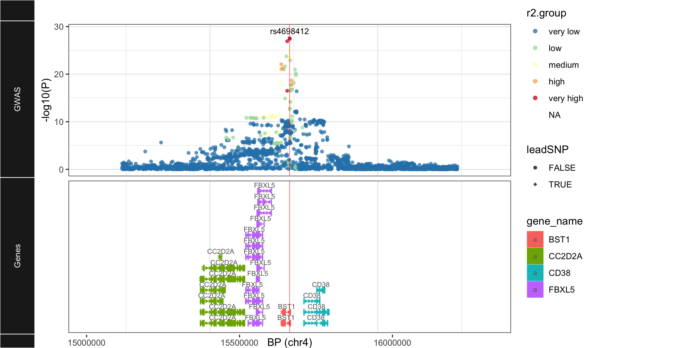

# ggLocusZoom
 

## Why?  

[LocusZoom](http://locuszoom.org) is a very useful and commonly used tool for visualizing genomic signals in GWAS/QTL data. But when you're making many plots for many loci, it makes sense to do this programmatically.  

There is a [standalone version of LocusZoom](https://github.com/statgen/locuszoom-standalone) for R and Python, but unfortunately it requires downloading 23GB of data to get all of the databases it relies on. Even if you supply your own data (summary stats, LD, etc.), it's not particularly user friendly. Nor can you customize it further once you have it.

So I made a user-friendly version of it in R that allows you to customize it as a ggplot-like object.

**Note**: [my.LocusZoom](https://my.locuszoom.org) now offers the ability to upload all your sum stats at once and make plots for each locus, which helps reduce the redundancy of making each plot individually.
  
<hr>

## How?  

### 1. Clone this GitHub repo  
In command line:  
`git clone https://github.com/RajLabMSSM/ggLocusZoom.git`  
`cd ggLocusZoom`


### 2. Prepare your data  

#### GWAS/QTL summary statistics
- Required columns in summary stats data (one SNP per row):
  + `SNP` :  RSID (e.g. rs4698412)
  + `P` : Uncorrected p-value from GWAS (e.g. 2.058e-28)
  + `CHR` : Chromosome (e.g. 4)
  + `POS` :  Genomic position in terms of bp (e.g. 15737348)  
  
#### LD matrix  

##### Method 1: Supply your own LD matrix  

- An *n* x *n* matrix where *n* is the number of SNPs in your summary stats file. Column and row names must be the RSIDs of the SNPs.
- Can be `.RDS`, `.csv`, `.tsv`, or `.txt` format.  

##### Method 2: Use the LD.UKBibank() function to download the LD matrix  

- If you don't have your own LD matrix, you can download it via the `LD.UKBibank()` function provided here. It will return the path to where the LD matrix was saved.

- **NOTE**: This takes a very long time (~10-15m/locus) because it has to first import a much larger LD matrix (in `.npz` format) from the [Alkes Price server](https://data.broadinstitute.org/alkesgroup/UKBB_LD) and then subset it to just the SNPs in your summary stats file. To save space, only the subset that includes your summary stat SNPs will saved saved (as a `.RDS` file).  
  + *For Mount Sinai employees and affiliates only*: That said, you can speed up this process a lot by logging into Chimera (Mount Sinai computing cluster). If you set `chimera=T`, then `LD.UKBibank()` will automatically find the UKB LD files that I've pre-downloaded, and imports the one you need. 

```
LD_path <- LD.UKBiobank(# Specify where the summary stats file is.
                         sumstats_path, 
                         
                         # The folder where you want to save the LD matrix 
                         # (defaults to ./LD)
                         results_path="./LD",
                         
                         # If =T , will overwrite a pre-existing LD file with the same name.
                         force_new_LD=F,
                         
                         # The same of the locus 
                         # (defaults to "_")
                         locus="BST",
                          
                         # Use pre-downloaded LD files on Chimera computing cluster 
                         # (Mount Sinai employees and affiliates only). 
                         # Must be logged onto Chimera and have 
                         # access to the 'pd-omics' project.
                         chimera=F, 
                         
                         # [** WARNING **]: Only change these defaults if you have plenty of extra storage. Each of these files is ~1-3GB.
                         ## Download and save the full .npz/.gz files.
                         download_full_ld=F,
                         ## Specify where to save these files.
                         full_ld_path="./UKB_LD")
print(LD_path)
```

### 3. Open R     
```
# Import the functions
source("./Rscripts/ggLocusZoom.R")

# Run 
gglz <- ggLocusZoom(# Specify where the summary stats file is.
                    sumstats_path="./example_data/BST1_Nalls23andMe_2019_subset.txt",
                    
                    # Specify where the pre-computed LD matrix is.
                    LD_path="../example_data/BST1_UKB-LD.RDS",
                    
                    # Is the LD matrix in units of r? (as opposed to r2)
                    LD_units="r",
                    
                    # Show the plot when it's ready?
                    show_plot=T,
                    
                    # Save the plot? (=F if you don't want to)
                    save_plot="./BST1_ggLocusZoom.png",
                    
                    # Saved plot height.
                    height=5, 
                    
                    # Saved plot width.
                    width=10,
                    
                    # Optional plot title.
                    title="",
                    
                    # Draw a vertical line at the position of the lead SNP.
                    leadSNP.line=T,
                    
                    # Plot LD with the leda SNP as a categorical variable 
                    # (very low, low, medium, high, very high) or a continuous variable (0-1).
                    categorical_r2=T)
```


<hr> 

## Wut?   

### Example data sources  
- `UKB_LD.RDS`: LD matrix from [UKBiobank](https://www.ukbiobank.ac.uk), preprocessed and made available by the [Alkes Price lab](https://data.broadinstitute.org/alkesgroup/UKBB_LD).  
- `BST1_Nalls23andMe_2019_subset.txt`: Summary stats from the PD GWAS in [Nalls et al. (2019)](https://www.biorxiv.org/content/10.1101/388165v3).  

### R Dependencies  
- [ggplot2](https://ggplot2.tidyverse.org)
- [data.table](https://cran.r-project.org/web/packages/data.table/vignettes/datatable-intro.html)
- [reticulate](https://rstudio.github.io/reticulate/)
- [ggbio](https://bioconductor.org/packages/release/bioc/html/ggbio.html)
- [dplyr](https://cran.r-project.org/package=dplyr/vignettes/dplyr.html)
- [EnsDb.Hsapiens.v75](http://bioconductor.org/packages/release/data/annotation/html/EnsDb.Hsapiens.v75.html)
- [BiocManager](https://cran.r-project.org/web/packages/BiocManager/vignettes/BiocManager.html)
- [biovizBase](https://bioconductor.org/packages/release/bioc/html/biovizBase.html)

<hr> 

## Who?  

Brian M. Schilder  
[Raj Lab](www.rajlab.org)  
Department of Neuroscience  
Department of Genetics & Genomic Sciences  
Ronald M. Loeb Center for Alzheimer's Disease  
Icahn School of Medicine at Mount Sinai  
